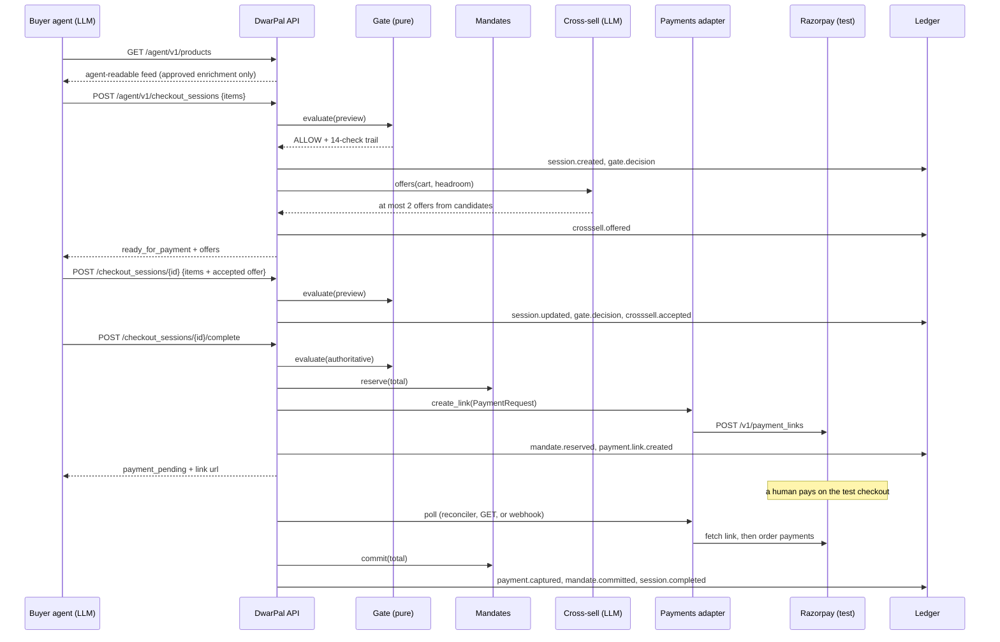

# Architecture

DwarPal is one Python process: a FastAPI app serving the agent-facing API and the merchant dashboard,
one SQLite file, and a set of small stores and services that share an injected clock. Money is integer
paise everywhere. The design rule is simple: **the model proposes, deterministic code disposes, and only the
payments adapter can reach Razorpay.**

The README carries the same picture in five generated diagrams — system context, the checkout sequence, the gate,
the session state machine and the domain model — in `docs/img/`, regenerated by `python scripts/make_diagrams.py`.

## Components and what each may touch

| Component | Module | Reads | May call | Trust note |
|---|---|---|---|---|
| Catalog | `catalog.py` | products table, Razorpay Items on sync | Razorpay Items API (read) | the feed only shows merchant-approved fields |
| Enrichment agent | `enrichment.py` | product title and description, the merchant's allowed categories | the LLM endpoint | output is validated and stored as *pending*; a human approves it before the gate can see a category |
| Policy gate | `gate.py` | a `GateInput`: agent, mandate, policy, catalog snapshot, cart, prior spend, clock, session status | nothing: pure function, no I/O, no clock reads, no LLM | the only thing that can say ALLOW; never raises (G99 guard) |
| Mandates | `mandates.py` | mandates and reservations | SQLite | reserve on complete, commit on capture, release on cancel or failure |
| Sessions | `sessions.py` | everything above plus the payments port | SQLite, payments port | the state machine; the only code path that creates a Payment Link, and only after ALLOW |
| Payments adapter | `razorpay_client.py` | a `PaymentRequest` | Razorpay Payment Links, Orders, Payments | sole holder of the Razorpay keys; refuses non-test keys; `FakePayments` stands in for tests |
| Cross-sell | `crosssell.py` | cart, catalog, headroom under every cap | the LLM endpoint | picks at most two from a deterministic candidate set; suggests only |
| Ledger | `ledger.py` | events | SQLite | append-only hash chain; verify, receipt, tamper demo |
| API | `api.py` | all of the above | — | bearer agent keys, plus Ed25519 request signatures for agents that registered a public key; ACP-shaped checkout sessions; webhook with HMAC check |
| Dashboard | `dashboard.py` + templates | all of the above | — | merchant token cookie |
| Buyer agent | `buyer/` | the public API only | the LLM endpoint, the API | a demo client outside the merchant trust boundary |
| Request signing | `signing.py` | the headers and body of one request | nothing: pure, no clock, no I/O | Ed25519 verify; the API supplies the clock and the nonce store, and refuses before anything else reads the request |
| Export | `export.py` | the discovery document, the feed, the policy | the filesystem | writes exactly what the API serves, so `data/` cannot drift from the server (CI checks) |
| Metrics | `metrics.py` | scripted runs on the fakes | — | honest batch numbers |

## Where the model is, and is not

The LLM is used in three places: proposing catalog metadata (category, attributes, tags, when to recommend),
choosing up to two cross-sell offers from a pre-filtered candidate list, and planning the demo buyer's
actions. It is not used to decide whether money moves. The gate, the reservation accounting, the session
transitions, the Razorpay calls and the ledger are plain code with unit tests.

Every model reply is parsed as JSON and validated (pydantic for enrichment, id-set membership for offers,
a fixed tool schema for the buyer). Product text reaches the model wrapped as untrusted, and one seed product
carries a prompt injection on purpose so the demo can show that the gate, not the prompt, is the control.

## Happy path

## The gate

`evaluate(GateInput) -> Decision` runs fourteen rules in a fixed order and stops at the first failure.
Every rule that ran is recorded with a plain-English detail, so the ledger and the API can show *why*.

| Rule | Checks | Source |
|---|---|---|
| G00_WELL_FORMED | non-empty cart, string ids, integer quantities ≥ 1, no duplicates, ≤ 20 lines | structure |
| G01_AGENT_ACTIVE | agent registered and not revoked | registry |
| G02_MANDATE_ACTIVE | an active INR mandate, inside its validity window | mandate |
| G03_ITEMS_KNOWN | every id exists in the catalog; lines priced from the merchant's own snapshot | catalog |
| G04_IN_STOCK | in stock, when the policy requires it | merchant policy |
| G05_SKU_NOT_BLOCKED | not on the blocked list | merchant policy |
| G06_MERCHANT_CATEGORY | category approved for agents; uncategorised items fail here | merchant policy |
| G07_QTY_PER_LINE | quantity within the per-line limit | merchant policy |
| G08_ORDER_MAX | total within the store's maximum order | merchant policy |
| G09_MANDATE_CATEGORY | within the mandate's categories, if it has any | mandate |
| G10_PER_TXN_CAP | total ≤ per-transaction cap | mandate |
| G11_DAILY_CAP | today's reserved + committed spend + total ≤ daily cap | mandate |
| G12_TOTAL_CAP | all reserved + committed spend + total ≤ total cap | mandate |
| G13_SESSION_STATE | the session is in a state where this evaluation makes sense (replay guard) | session |
| G14_REVIEW_THRESHOLD | total above the merchant's review threshold → verdict REVIEW, unless the merchant approved this exact total | merchant policy |
| G99_GATE_ERROR | guard: any internal error becomes a DENY with the exception type in the trail | guard |

Three modes share the rules: `preview` on create and update (no money reserved), `authoritative` on
complete (money reserved, link created), `retry` before a second payment attempt (the session's own
reservation is excluded from spend so the retry is judged fairly).

Refunds are money actions too. `evaluate_refund(RefundInput)` runs RF00 (well-formed amount, reason, reference),
RF01 (session completed with a captured payment), RF02 (within the refundable balance), RF03 (no duplicate
reference), RF04 (inside the policy's refund window), with the same G99 guard. A refund returns budget against the
mandate's total cap but not the daily cap.

## Request signing

A bearer key is a secret that travels with every request. An agent that would rather not bet on that registers
an Ed25519 public key (`agent add --pubkey`, or the dashboard); from then on the API refuses any request from it
that does not carry `X-Agent-Timestamp`, `X-Agent-Nonce` and `X-Agent-Signature`. The signature is over
`ts 
 nonce 
 METHOD 
 path?query 
 sha256(body)`, the timestamp must be within 300 s of the merchant's
clock, and each nonce is accepted once per agent (`agent_nonces`, pruned after ten minutes). The check runs in
`api.current_agent` before anything else touches the request, and every failure is a typed 401. `signing.py` is
pure; the API supplies the clock and the nonce store. Bearer-only agents are unaffected.

## Merchant review queue

Orders above `policy.review_above_paise` get verdict REVIEW and the status `requires_review`. The merchant approves
or declines in the dashboard (or `review approve|decline` on the CLI). An approval is stored with the exact total it
covers; if the agent changes the cart, the gate asks again. A decline moves the session to `not_ready_for_payment`
with a message the agent can read and react to.

## Where money moves

Exactly one call creates a money action: `RazorpayPayments.create_link(PaymentRequest)`, called from
`SessionService.complete` after ALLOW and after the mandate reservation, and from the retry path after a
`retry` ALLOW. The link carries the session, agent and mandate ids in its notes and the session id plus
attempt number as its reference id.

Payment results arrive by polling: the reconciler thread (every 3 s under `serve`), a `GET` on the session,
or a webhook. Razorpay lists only captured payments on the link itself, so failed attempts are read from
the link's order once it exists, and from the payments list matched on notes before that.

## Session state machine

| From | Event | To | Side effects |
|---|---|---|---|
| — | create, ALLOW | ready_for_payment | offers; `session.created`, `gate.decision`, `crosssell.offered` |
| — | create, DENY | not_ready_for_payment | `messages[]` carries the rule and reason |
| — | create, REVIEW | requires_review | `review.requested`; the merchant approves (→ ready) or declines (→ not_ready) |
| completed | merchant refund, RF ALLOW | completed | `refund.decision`, `refund.created`; budget returned to the mandate |
| not_ready / ready | update | re-evaluated | `session.updated`, `gate.decision`, `crosssell.accepted` if an offer was taken |
| ready | complete, ALLOW | payment_pending (attempt 1) | reserve; create link |
| ready | complete, DENY | not_ready_for_payment | HTTP 409 `policy_denied` with `rule_id` |
| ready | complete, provider error | ready_for_payment | release; HTTP 502; the agent may retry |
| payment_pending | capture seen | completed | commit; `payment.captured`, `mandate.committed`, `session.completed` |
| payment_pending | failed attempt or expired link, attempt 1 | payment_pending (attempt 2) | gate in `retry` mode; cancel old link; fresh link; `payment.retry` |
| payment_pending | failed attempt, attempt 2 | canceled | cancel link; release; `payment.abandoned` |
| any non-terminal | cancel | canceled | in payment_pending: cancel link first, then release |
| payment_pending | cancel refused by Razorpay | one final poll | a late capture completes the session; otherwise `payment.link.cancel_failed` and the session stays pending |

## Ledger

One table, append-only. `hash = sha256(prev_hash + canonical_json({seq, id, ts, type, actor, session_id,
payload}))` with a genesis previous hash of 64 zeros. `verify` recomputes every hash and reports the first
bad sequence number. `receipt` renders one session as Markdown with the cart, the decision trail, the payment
events and the chain status. `tamper` edits one amount in place for the demo so `verify` shows the break.

The chain detects modification, insertion, deletion and reordering. On its own it cannot detect a cut tail or a
last event that was replaced and re-hashed, because nothing after the cut vouches for what was there. An **anchor**
closes that gap: `ledger anchor` prints the head as `<seq>:<hash>`, every `GET …/trail` response and `/health`
carry the same pair as `ledger_head`, and `ledger verify --anchor <seq>:<hash>` fails if the ledger is shorter than
the anchor or the event at that seq no longer has that hash. An agent that keeps the anchor from its last trail
holds proof the merchant cannot shrink the record past it. Tamper-evident with a witness, not tamper-proof.

### Replay

Every `gate.decision` and `refund.decision` event carries the exact input the pure gate consumed: agent, mandate,
policy, the catalog entries for the items in the cart, the cart, prior spend, the clock, the mode and whether a
merchant approval applied. `ledger replay` rebuilds each input, re-runs the gate and compares verdict, rule, reason,
checks and total. `verify` proves the record was not edited; `replay` proves the record was reasoned correctly.

## Concurrency

One SQLite connection per process, WAL mode, and a re-entrant lock around every transaction so FastAPI's
request threads and the reconciler thread never interleave writes. Good enough for one merchant and a demo;
Postgres would replace the connection layer without touching the domain code.
