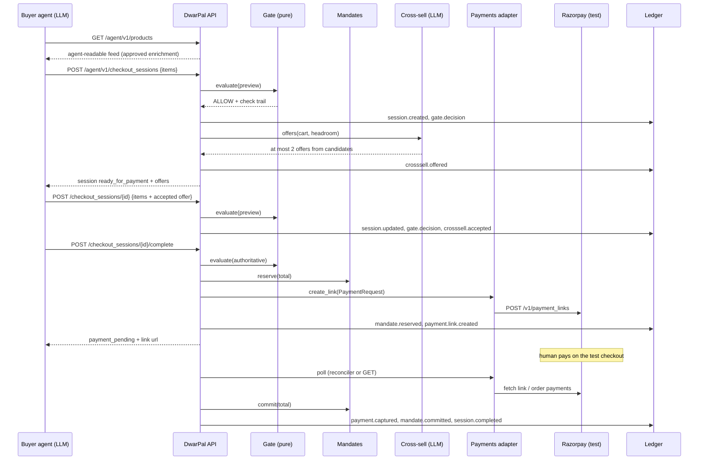

# DwarPal — Design Spec

Date: 2026-09-03. Entry for Razorpay AI Buildathon 2026, Track 01 (AI Growth & Agentic Commerce).
Status: approved design; implementation plan in `docs/superpowers/plans/`.

## 1. Goal

Make any Razorpay merchant sellable to AI buyer agents end to end, on Razorpay test mode, such that:

- every money action is **explainable** (a rule-by-rule decision trail on every checkout),
- **bounded** (merchant policy plus a per-agent spend mandate, enforced by a pure function, never by a prompt),
- **gated** (the LLM proposes catalog metadata, offers and carts; only deterministic code creates a Razorpay object),
- **audited** (a hash-chained ledger with a verify command and a per-session receipt),
- and the merchant's basket **grows** through a bounded cross-sell whose effect is measured honestly across a batch.

The pitch: "DwarPal makes a Razorpay merchant sellable to AI agents, safely."

## 2. Scope

**In (v1, the slice that must be demo-able by 2026-09-05):**

1. Agent-readable catalog: products seeded locally or synced from the merchant's Razorpay Items (test mode), plus an LLM enrichment step whose output the merchant approves before the gate trusts it.
2. Agent-facing HTTP API in the shape of the OpenAI/Stripe Agentic Commerce Protocol (ACP) checkout sessions, with bearer agent keys and idempotency keys. Documented deviations, no conformance claim.
3. Deterministic policy gate: ordered rules over merchant policy and the agent's mandate; ALLOW or DENY with a full check trail.
4. Per-agent spend mandates with reserve / commit / release accounting so an agent can never over-commit mid-flight.
5. Payment on Razorpay test mode via Payment Links, with polling reconciliation, optional webhook endpoint, and a one-retry failure recovery path.
6. Hash-chained ledger: verify, receipt, tamper demo.
7. Cross-sell: deterministic candidate filter, LLM picks at most two, agent may accept; attach rate measured.
8. Demo buyer agent (scripted planner for tests and metrics; OpenAI-compatible LLM planner for the video) that replans after a refusal.
9. Batch metrics script over fake Razorpay: mandate overruns, unexplained denials, failure outcomes, attach rate, ledger integrity.
10. Small merchant dashboard (server-rendered): products and enrichment approval, agents and mandates, policy, sessions with trail, ledger verify.
11. README, architecture doc, form answers, demo script.

**Out (listed as future work in the README):** delegated sub-mandates; gated refunds; signed AP2-style mandates (we use bearer keys); multi-merchant; multi-currency (INR only); production keys (the adapter refuses non-`rzp_test_` keys); UPI autopay / Reserve Pay (no public agent API yet); ACP conformance tests; MCP server wrapper; policy compiler and ledger Q&A (LLM read-only helpers); manual-review queue for large orders.

## 3. Architecture

Single Python package `dwarpal/`, one FastAPI process, one SQLite file. Money is integer paise everywhere.

| Component | Module | Reads | May call | Trust note |
|---|---|---|---|---|
| Catalog | `catalog.py` | products table, Razorpay Items (sync) | Razorpay Items API (read) | approved enrichment only |
| Enrichment agent | `enrichment.py` | product title/description, allowed categories | LLM endpoint | output is **pending** until a merchant approves it |
| Policy gate | `gate.py` | GateInput (agent, mandate, policy, catalog snapshot, items, spend, now) | nothing: pure function, no I/O, no clock, no LLM | the only thing that can say ALLOW |
| Mandates | `mandates.py` | mandates, reservations | DB | reserve on complete, commit on capture, release on cancel/abandon |
| Sessions | `sessions.py` | sessions, gate, mandates, payments adapter | DB, payments adapter | state machine; the only code path that creates a Payment Link |
| Payments adapter | `payments.py`, `razorpay_client.py` | a `PaymentRequest` | Razorpay Payment Links, Orders, Payments (test mode) | sole holder of Razorpay keys; `FakePayments` for tests |
| Reconciler | `sessions.py` (`reconcile`) | sessions in `payment_pending` | payments adapter | polls; drives retry / abandon |
| Cross-sell agent | `crosssell.py` | cart, catalog, headroom | LLM endpoint | picks from a deterministic candidate set; offers only |
| Ledger | `ledger.py` | events | DB | append-only hash chain |
| API | `api.py` | all above | — | bearer agent keys; merchant token for dashboard |
| Dashboard | `dashboard.py`, `templates/` | all above | — | merchant-only |
| Buyer agent (demo client) | `buyer/` | the public API only | LLM endpoint, DwarPal API | outside the merchant trust boundary |
| Metrics | `metrics.py` | scripted runs on fakes | — | honest numbers |
| CLI | `cli.py` | — | everything | `python -m dwarpal ...` |

Where the LLM is: enrichment proposals, cross-sell picks, the demo buyer's planning. Where it is not: the gate, mandate accounting, session transitions, Razorpay calls, the ledger.

### Happy-path sequence

## 4. Data model (SQLite, `schema.sql`)

- `products(id TEXT PK, razorpay_item_id TEXT, title, description, price_paise INTEGER, currency TEXT, availability TEXT CHECK in ('in_stock','out_of_stock'), category TEXT NULL, attributes TEXT JSON, tags TEXT JSON, recommend_when TEXT NULL, url TEXT, image_url TEXT, source TEXT CHECK in ('seed','razorpay'), updated_at INTEGER)`
- `enrichments(id TEXT PK, product_id, proposal TEXT JSON, model TEXT, status TEXT CHECK in ('pending','approved','rejected'), created_at, decided_at NULL)`
- `agents(id TEXT PK, name TEXT, api_key_hash TEXT UNIQUE, status TEXT CHECK in ('active','revoked'), created_at)`. Keys look like `agk_<32 url-safe chars>`, shown once, stored as SHA-256.
- `mandates(id TEXT PK, agent_id, currency TEXT, per_txn_cap_paise, daily_cap_paise, total_cap_paise, categories TEXT JSON, starts_at, expires_at, status TEXT CHECK in ('active','revoked'), created_at)`. At most one active mandate per agent; an empty `categories` list means the mandate does not restrict category.
- `policy(id INTEGER PK CHECK (id=1), json TEXT, updated_at)`. Shape: `{"max_order_paise": int, "allowed_categories": [str], "blocked_skus": [str], "max_qty_per_line": int, "in_stock_only": bool}`.
- `sessions(id TEXT PK, agent_id, mandate_id NULL, status TEXT, line_items TEXT JSON, totals TEXT JSON, messages TEXT JSON, offers TEXT JSON, last_decision TEXT JSON, idempotency_key TEXT, create_body_hash TEXT, complete_key TEXT NULL, link_id TEXT NULL, link_url TEXT NULL, link_expire_at INTEGER NULL, order_id TEXT NULL, attempt INTEGER DEFAULT 0, created_at, updated_at, completed_at NULL)`
- `reservations(id TEXT PK, session_id, mandate_id, amount_paise, state TEXT CHECK in ('reserved','committed','released'), created_at, updated_at)`
- `payments(id TEXT PK, session_id, razorpay_payment_id TEXT, status TEXT CHECK in ('captured','failed'), amount_paise, error_code TEXT NULL, error_description TEXT NULL, attempt INTEGER, created_at, UNIQUE(session_id, razorpay_payment_id))`
- `ledger(seq INTEGER PK AUTOINCREMENT, id TEXT, ts INTEGER, type TEXT, actor TEXT, session_id TEXT NULL, payload TEXT JSON, prev_hash TEXT, hash TEXT)`
- `webhook_events(event_id TEXT PK, received_at)`

Ids: `prod_`, `enr_`, `agt_`, `mnd_`, `cs_`, `rsv_`, `lp_`, `evt_` prefixes plus 12 random url-safe chars.

## 5. Agent-facing API (ACP-shaped)

Base path `/agent/v1`. Auth: `Authorization: Bearer agk_...` on everything except the well-known document. `Idempotency-Key` header is required on `POST /checkout_sessions` and `POST /checkout_sessions/{id}/complete`; replaying the same key with the same body returns the stored response, a different body returns `request_not_idempotent`. `Request-Id` is optional and echoed.

| Method and path | Purpose |
|---|---|
| `GET /.well-known/agent-commerce.json` | Discovery: merchant id and name, currency, feed and checkout URLs, payment rails `["razorpay:payment_link"]`, policy summary (allowed categories, max order), api version `2026-09-03` |
| `GET /agent/v1/products?q=&category=` | Feed. Fields: `id, title, description, price_paise, currency, availability, category, attributes, tags, recommend_when, url, image_url`. Enrichment fields appear only once approved. |
| `POST /agent/v1/checkout_sessions` | Body `{"items":[{"id","quantity"}]}`. Runs the gate in preview mode (no reservation). ALLOW: status `ready_for_payment`, `offers` filled. DENY: status `not_ready_for_payment`, `messages` carries `{type:"error", code:"policy_denied", rule_id, text}`. Always returns a session id. |
| `POST /agent/v1/checkout_sessions/{id}` | Replace items (accept an offer by including its id). Allowed from `not_ready_for_payment` and `ready_for_payment`. Re-runs the gate and cross-sell. |
| `POST /agent/v1/checkout_sessions/{id}/complete` | From `ready_for_payment`: authoritative gate run, reservation, Payment Link. Response status `payment_pending` with `payment: {provider:"razorpay", method:"payment_link", url, link_id, amount_paise, expires_at, attempt}`. DENY at this step returns HTTP 409 `policy_denied` and moves the session to `not_ready_for_payment`. |
| `POST /agent/v1/checkout_sessions/{id}/cancel` | From `not_ready_for_payment`, `ready_for_payment` or `payment_pending`. In `payment_pending` the link is cancelled and the reservation released. |
| `GET /agent/v1/checkout_sessions/{id}` | Current state. Triggers one reconciliation poll when `payment_pending`. |
| `GET /agent/v1/checkout_sessions/{id}/trail` | Ledger events for the session plus chain head and verify status. |
| `POST /webhooks/razorpay` | Optional. Verifies `X-Razorpay-Signature` with `RAZORPAY_WEBHOOK_SECRET`, dedupes on event id, records `webhook.received`, then reconciles the session named in the payment's notes. Everything it does, the reconciler also does by polling. |

Session object: `{id, status, currency, line_items:[{id, title, quantity, unit_price_paise, line_total_paise, category}], totals:{subtotal_paise, total_paise}, messages:[], offers:[{id, title, price_paise, reason}], decision:{verdict, rule_id, reason, checks:[{rule, ok, detail}]}, payment: null | {...}, links:{trail}, created_at, updated_at}`.

Error format: `{"type": "invalid_request" | "policy_denied" | "session_state" | "not_found" | "unauthorized" | "provider_error", "code": "...", "message": "...", "param": "..."?}`. Codes include `missing`, `invalid`, `unknown_item`, `out_of_stock`, `request_not_idempotent`, `policy_denied` (with `rule_id`), `wrong_state`, `payment_provider_error`.

Deviation from ACP, stated in the README: `payment_pending` is an extra status because on Razorpay test mode the payment is completed by a human on the link, not by a delegated payment token; ACP's `complete` returns `completed` synchronously.

## 6. Policy gate

`evaluate(gi: GateInput) -> Decision`, a pure function. `GateInput`: `agent` (id, status) or None, `mandate` (or None), `policy` dict, `catalog` (dict product id -> product snapshot), `items` (list of `{id, quantity}`), `spent_today_paise`, `spent_total_paise`, `now`, `session_status`, `mode` (`preview` | `authoritative` | `retry`). `Decision`: `verdict` (`ALLOW` | `DENY`), `rule_id`, `reason`, `checks` (every rule evaluated in order with `ok` and a plain-English `detail`), `lines`, `total_paise`. First failing rule decides; rules after it are not evaluated. Every rule has one unit test for pass and one for fail.

| # | Rule | Check | Source |
|---|---|---|---|
| G00 | `WELL_FORMED` | items non-empty, ids are strings, quantities integers >= 1, no duplicate ids, at most 20 lines | structure |
| G01 | `AGENT_ACTIVE` | agent exists and status is `active` | registry |
| G02 | `MANDATE_ACTIVE` | mandate exists, status `active`, `starts_at <= now < expires_at`, currency INR | mandate |
| G03 | `ITEMS_KNOWN` | every id is in the catalog snapshot | catalog |
| G04 | `IN_STOCK` | when `policy.in_stock_only`, every item is `in_stock` | merchant policy |
| G05 | `SKU_NOT_BLOCKED` | no id in `policy.blocked_skus` | merchant policy |
| G06 | `MERCHANT_CATEGORY` | every item's category is in `policy.allowed_categories`; an uncategorised item fails with "not yet categorised" | merchant policy |
| G07 | `QTY_PER_LINE` | every quantity <= `policy.max_qty_per_line` | merchant policy |
| G08 | `ORDER_MAX` | total <= `policy.max_order_paise` | merchant policy |
| G09 | `MANDATE_CATEGORY` | if `mandate.categories` is non-empty, every item's category is in it | mandate |
| G10 | `PER_TXN_CAP` | total <= `mandate.per_txn_cap_paise` | mandate |
| G11 | `DAILY_CAP` | `spent_today + total <= daily_cap` | mandate |
| G12 | `TOTAL_CAP` | `spent_total + total <= total_cap` | mandate |
| G13 | `SESSION_STATE` | `authoritative`: session status must be `ready_for_payment`; `retry`: must be `payment_pending`; `preview`: must be `not_ready_for_payment`, `ready_for_payment` or None (new) | session |
| G99 | `GATE_ERROR` | guard: any exception inside the gate becomes DENY with the exception type in the detail; the gate never raises | guard |

Spend figures passed in exclude the session's own reservation (relevant when re-running the gate before a retry). `spent_today` uses the UTC calendar day of `now`.

## 7. Mandates: reserve, commit, release

- `complete` reserves `total_paise` for the session's mandate (`reservations.state = reserved`).
- A captured payment commits the reservation.
- Cancel, abandon, provider error, or a denial at retry releases it.
- `spent_total = sum(committed) + sum(reserved)` for the mandate; `spent_today` is the same restricted to reservations created on the UTC day of `now`.
- Exactly one open reservation per session; a second `complete` on the same session is refused by G13.
- Revoking an agent or mandate does not touch open reservations; the reconciler still completes or releases them so the ledger stays truthful.

## 8. Session state machine and failure recovery

States: `not_ready_for_payment`, `ready_for_payment`, `payment_pending`, `completed`, `canceled`.

| From | Event | To | Side effects |
|---|---|---|---|
| — | create, gate ALLOW | `ready_for_payment` | cross-sell offers; ledger `session.created`, `gate.decision`, `crosssell.offered` |
| — | create, gate DENY | `not_ready_for_payment` | ledger `session.created`, `gate.decision` |
| not_ready / ready | update | re-evaluated | ledger `session.updated`, `gate.decision`, `crosssell.accepted` when an offered id appears, `crosssell.offered` when new offers are made |
| ready | complete, gate ALLOW | `payment_pending` (attempt 1) | reserve; create link; ledger `mandate.reserved`, `payment.link.created` |
| ready | complete, gate DENY | `not_ready_for_payment` | ledger `gate.decision`; HTTP 409 |
| ready | complete, provider error | `ready_for_payment` | release; ledger `provider.error`; HTTP 502 `payment_provider_error`; the agent may retry with a new idempotency key |
| payment_pending | capture seen | `completed` | commit; ledger `payment.captured`, `mandate.committed`, `session.completed` |
| payment_pending | failed attempt seen, attempt 1 | `payment_pending` (attempt 2) | re-run gate in `retry` mode on the same cart; on ALLOW cancel the old link, create a fresh one; ledger `payment.failed`, `gate.decision`, `payment.retry`, `payment.link.created`; on DENY release, `canceled` |
| payment_pending | failed attempt seen, attempt 2 | `canceled` | cancel link; release; ledger `payment.failed`, `payment.abandoned`, `mandate.released`, `session.canceled` |
| payment_pending | link expired or poll timeout | treated as a failed attempt | same as above |
| any non-terminal | cancel | `canceled` | in `payment_pending` cancel the link first; release; ledger `session.canceled` |
| payment_pending | cancel call to Razorpay fails | one final poll | a late capture completes the session; otherwise `payment.link.cancel_failed` is recorded and the session stays `payment_pending` for the reconciler |

Idempotency and duplicate events: a webhook or poll result for a payment id already recorded is ignored (`payments` is unique on session id plus Razorpay payment id). Webhook event ids are stored in `webhook_events`.

## 9. Razorpay integration (test mode)

- SDK: `razorpay` Python package. `RazorpayPayments` refuses any key id not starting with `rzp_test_`. Every call has a 10 s timeout.
- Create: `payment_link.create({amount, currency:"INR", description, reference_id: session id + attempt, notes:{session_id, agent_id, mandate_id, attempt}, expire_by: now + 20 min, notify:{sms:false,email:false}, reminder_enable:false})`. Payment Links must expire at least 15 minutes out.
- Poll: `payment_link.fetch(id)`; `status == "paid"` gives the captured payment in `payments[]`. The link's `payments` array lists only captured payments, so failed attempts are read from `order.payments(order_id)` once the link carries an `order_id`; before that, `payment.all()` filtered on `notes.session_id`.
- Cancel: `payment_link.cancel(id)`.
- Items sync: `item.all({count: 100})` maps `name -> title`, `description`, `amount -> price_paise`, `currency`; only `active` items; `category` stays null until enrichment is approved; existing local overlay fields are preserved on re-sync. `seed --push` creates the demo products as Items in the test account so the sync demo is real.
- Test-mode limits: about 30 Payment Links per test account, so tests and metrics use `FakePayments`; real calls are reserved for the smoke script and the recorded demo. Human pays on the link using the test checkout (netbanking mock bank Success / Failure buttons, or `success@razorpay` / `failure@razorpay` when UPI is enabled on the account).
- `FakePayments`: in-memory links, scripted outcomes via `FAKE_OUTCOMES=paid|failed|pending|expired|error,...` consumed per link; can also raise on create to test provider errors.

## 10. AI components

All LLM calls go through one thin client (`llm.py`) over an OpenAI-compatible chat-completions endpoint (`LLM_BASE_URL`, `LLM_API_KEY`, `LLM_MODEL`, `LLM_TIMEOUT_S`), so Gemini's free tier, Groq, NVIDIA NIM or a local Ollama all work. Every component also has a deterministic fake used by tests and metrics, selected with `--fake-llm` or when no key is configured. Model output is parsed as JSON and validated with pydantic; invalid output is recorded and discarded, never acted on.

**Enrichment (`enrichment.py`).** Input: title, description, the merchant's allowed categories. Output schema: `{category: one of allowed ∪ {"other"}, attributes: {str: str} (<= 8), tags: [str] (<= 8), recommend_when: str (<= 200 chars)}`. Stored as a pending `enrichments` row; the dashboard (or `approve` CLI) promotes it into `products`. Rejected proposals are kept for the record. Ledger: `catalog.enrichment.proposed`, `.approved`, `.rejected`. The fake enricher uses keyword rules.

**Cross-sell (`crosssell.py`).** Deterministic candidates: in stock, category allowed by policy and by the mandate, not already in the cart, `price_paise <= headroom` where `headroom = min(per_txn_cap - total, daily_cap - spent_today - total, total_cap - spent_total - total, policy.max_order - total)`; sorted by price ascending, at most 8. If no candidates, no LLM call. The LLM receives cart titles and candidate titles and returns `[{id, reason}]` with at most two ids, validated against the candidate set. Offers are stored on the session and shown in the response; accepting means including the id in an update. Ledger: `crosssell.offered` (with candidate count), `crosssell.accepted`. The fake picker chooses by tag overlap then price. By construction an accepted offer still passes the gate, and the metrics script asserts it.

**Buyer agent (`buyer/`).** A demo client outside the merchant trust boundary. Tools: `list_products`, `create_checkout_session`, `update_checkout_session`, `complete_checkout_session`, `get_checkout_session`. The system prompt carries the user's intent and stated budget, wraps catalog text as untrusted, and instructs: browse, create a session, if the session is `not_ready_for_payment` read the rule and replan (at most 3 rounds), accept an offer only if it fits the user's budget, then complete and report the payment link. `ScriptedPlanner` replays a fixed plan for tests and metrics. The agent prints a short narrative for the video.

## 11. Ledger

Append-only table. `hash = sha256(prev_hash + canonical_json({seq, id, ts, type, actor, session_id, payload}))`, genesis `prev_hash` is 64 zeros, canonical JSON is sorted keys with no whitespace. `verify()` recomputes every hash and reports the first bad seq. `receipt(session_id)` renders Markdown: cart, decision trail, payment attempts, mandate movements, chain head and verify status. `tamper(seq)` edits one payload amount in place for the demo so `verify` shows the break. Tamper-evident, not tamper-proof; tail truncation is not detected, so the receipt's head hash is the external anchor.

Event types: `catalog.synced`, `catalog.enrichment.proposed|approved|rejected`, `agent.registered|revoked`, `mandate.created|revoked|reserved|committed|released`, `policy.updated`, `session.created|updated|completed|canceled`, `gate.decision`, `crosssell.offered|accepted`, `payment.link.created|cancelled|cancel_failed`, `payment.captured|failed|retry|abandoned`, `provider.error`, `webhook.received`.

## 12. Dashboard

FastAPI + Jinja2, no build step, one CSS file. Auth: `MERCHANT_TOKEN` env; `/dashboard/login?token=` sets a cookie. Pages: overview (counts, last decisions, ledger verify status), products (sync button, run enrichment, approve/reject each pending proposal, side-by-side raw vs proposed), agents (register with name and mandate caps, key shown once, revoke), policy (JSON editor with validation), sessions (list, detail with decision trail and payment attempts, cancel), ledger (table, verify button, receipt link).

## 13. CLI (`python -m dwarpal ...`)

`init` (create db, default policy), `seed [--push]` (demo catalog; `--push` also creates Razorpay Items), `sync-items`, `enrich [--fake-llm]`, `approve --all | --id ENR`, `agent add NAME --per-txn --daily --total [--categories a,b]` (prints the key once), `agent revoke ID`, `policy set FILE.json`, `serve [--port]`, `reconcile --once`, `ledger verify | receipt SESSION | tamper SEQ`, `metrics [--n 50] [--out FILE]`, `demo --scenario happy|refused|replan|payfail|crosssell [--planner llm|scripted] [--payments real|fake]`.

`demo` starts the API in-process, runs the buyer agent against it, prints the narrative and the ledger trail, and with `--payments real` prints the link and waits for the human to pay. With `--payments fake` the fake adapter resolves the outcome from `FAKE_OUTCOMES`.

Exit codes: 0 success (a refused purchase is still a clean run), 1 configuration or provider error, 2 broken ledger.

## 14. Testing, eval and metrics

- `pytest`, fully offline: `FakePayments`, fake LLM, fixed clock. Target: one pass and one fail test per gate rule (about 30), state machine transitions including retry and abandon, reservation accounting and daily/total caps, idempotency replay and mismatch, API auth, enrichment validation (bad category, oversized fields), cross-sell headroom and candidate validation, ledger chain and tamper, buyer agent replan with the scripted planner, metrics run. Target 120+ tests.
- `metrics` runs N scripted sessions on `FakePayments`: roughly 55% allowed and paid, 25% refused (spread across rules), 15% first attempt fails then paid, 5% abandoned; half of allowed sessions accept an offer. It reports: sessions by outcome, denials by rule id (all explained), mandate overruns (asserted 0 by checking committed + reserved against every cap), failure recovery (retried, recovered, released), cross-sell offers, acceptances and attach rate, average basket with and without an accepted offer, ledger verify. Output Markdown under `runs/`. The README states plainly that these are scripted inputs against deterministic code and what they do and do not prove.

## 15. Deliverables and demo script

Repo (this folder), README with quickstart and honest limitations, `docs/architecture.md`, `docs/form-answers.md`, `docs/demo-script.md`, the metrics report, a 5-minute video.

Video beats: (1) why now: UAP at Global Fintech Fest, Razorpay agentic pilots, ACP; (2) merchant setup: sync Items, enrichment proposed and approved, register an agent with a mandate; (3) happy purchase with an accepted cross-sell, pay on the test checkout, trail shown; (4) refusal: the agent tries a blocked category over the cap, gate says why, agent replans within the mandate; (5) failure: first attempt fails on the mock bank, one retry link, paid; (6) ledger verify, tamper, metrics table.

Demo merchant: "Trail & Turf", a sports goods store. Seed catalog (INR): running shoes 2,499; trail socks 3-pack 499; steel bottle 1L 699; yoga mat 1,299; resistance bands 899; cotton tee 799; running cap 599; smartwatch 6,999 (category `electronics`, not in the merchant's allowed categories); knee brace 1,199 (out of stock); energy gel box 1,499. Default policy: allowed categories `footwear, apparel, accessories, fitness`, max order 5,000, max qty per line 5, in-stock only, no blocked SKUs. Demo agent mandate: 4,000 per transaction, 8,000 daily, 20,000 total, no category restriction.

## 16. Honest limitations

Test mode only. The human completes the payment on the link; Razorpay has no public delegated-payment token for agents yet, so "end to end" means the agent does everything up to and after the payment authorisation. Polling by default; webhooks optional. One merchant, one process, SQLite. Bearer keys rather than signed mandates. LLM output never reaches the gate without merchant approval (enrichment) or deterministic validation (offers). UAP has no public spec; nothing here claims conformance to UAP, ACP, UCP or AP2.

## 17. Protocol context

OpenAI/Stripe ACP (checkout session shape), Google AP2 (mandate vocabulary), Google UCP, NPCI UAP (registered agents, user-set limits), UPI Circle. `docs/protocol-mapping.md` says what is borrowed from each; nothing claims conformance.

## 18. Build order

1. Scaffold, config, db, money, ledger.
2. Catalog, seed, policy, agents, mandates, gate.
3. Sessions state machine, reservations, FakePayments, reconciler.
4. API with idempotency and errors.
5. Razorpay adapter, Items sync, webhook, smoke script.
6. LLM client, enrichment, cross-sell.
7. Buyer agent and demo scenarios.
8. Metrics.
9. Dashboard.
10. README, architecture, form answers, demo script.
